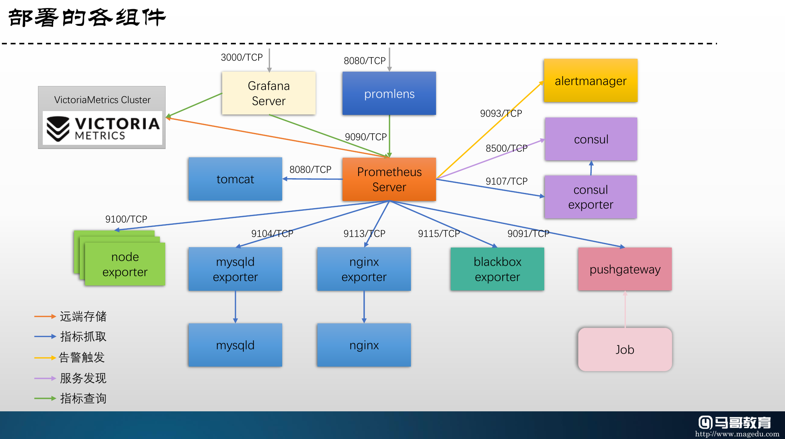

# Prometheus Components Compose

本示例中的每个目录，均是可独立运行的docker compose配置示例，它们分别用于编排同的应用，具体的组件请参考各目录的名称。



### 前提条件

使用本示例，需要在测试的各主机确保正确解析以下主机名：

- Prometheus Server: prometheus.magedu.com
- AlertManager: alert.magedu.com
- Consul Server and Consul Exporter: consul.magedu.com
- Blackbox Exporter: probe.magedu.com
- MySQL and mysqld Exporter: mysql.magedu.com
- Nginx and Nginx Exporter: nginx.magedu.com
- Tomcat: tomcat.magedu.com
- Grafana: grafana.magedu.com
- Server01: server01.magedu.com
- Server02: server02.magedu.com
- Server03: server03.magedu.com

### 部署服务

#### 启动Consul和Consul Exporter

```bash 
cd 08-prometheus-components-compose/consul-and-exporter/
docker-compose up -d
```

访问Consul UI：

http://consul.magedu.com:8500

#### 启动Prometheus Server

```bash
cd 08-prometheus-components-compose/prometheus-server/
docker-compose up -d
```

> 提示：可以直接使用示例中的example-no-alertmanager.yml示例配置文件替换默认的prometheus.yml配置文件，从而直接监控各目标组件；

访问Prometheus UI：

http://prometheus.magedu.com:9090

#### 在各节点启动Node Exporter

```bash
cd nginx-and-exporter/
docker-compose up -d
```

#### 启动MySQL Server和mysqld_exporter

```bash
cd node-exporter/
docker-compose up -d
```

而后需要接入mysql server，创建用于监控的用户并完成授权

```bash
docker-compose exec mysqld /bin/sh
mysql
```

而后执行如下mysql命令

```
mysql> CREATE USER 'exporter'@'172.31.%.%' IDENTIFIED BY 'exporter';
mysql> GRANT PROCESS, REPLICATION CLIENT ON *.* TO 'exporter'@'172.31.%.%';
mysql> GRANT SELECT ON performance_schema.* TO 'exporter'@'172.31.%.%';
```

> 提示：本示例中，mysqld和mysqld-exporter容器运行于一个自定义的网络172.31.0.0/16之中。

#### 启动Nginx和nginx_exporter

```bash
cd nginx-and-exporter/
docker-compose up -d
```

#### 启动tomcat

```bash
cd tomcat-and-metrics/
docker-compose build
docker-compose up -d
```

#### 启动Blackbox Exporter

...

#### 启用AlertManager

...