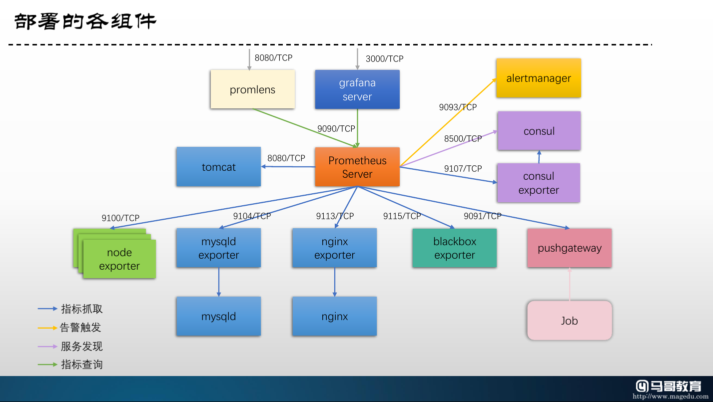

# Prometheus Components Compose

本示例中的每个目录，均是可独立运行的docker compose配置示例，它们分别用于编排同的应用，具体的组件请参考各目录的名称。

### 前提

使用本示例，需要在测试的各主机确保正确解析以下主机名：

- Prometheus Server: prometheus.magedu.com
- AlertManager: alert.magedu.com
- Consul Server and Consul Exporter: consul.magedu.com
- Blackbox Exporter: probe.magedu.com
- MySQL and mysqld Exporter: mysql.magedu.com
- Nginx and Nginx Exporter: nginx.magedu.com
- Tomcat: tomcat.magedu.com
- Grafana: grafana.magedu.com
- Server01: server01.magedu.com
- Server02: server02.magedu.com
- Server03: server03.magedu.com